# Traffic Sign Classifier Notes

## Lesson 11: Neural Networks

Build and train neural networks from linear and logistic regression to backpropagation and multilayer perceptron networks

### Neural Network Intuition

AI - Artificial Intelligence - Specifically neural networks

Neural Networks - your brain and it has 10^11 neurons

People have abstracted the brain into a basis of equations that emulate a network of artificial neurons and people have invented ways to train these systems based on data

So, rather than instructing a machine with rules like a piece of software, these neural networks are trained based data

Basic Terminology

- Perceptron
- Backpropagation

By end of lesson you will know how to write and code and train your own neural network.

### Introduction to Deep Learning

You'll train a Deep Neural Network (DNN) to drive a car in a simulator. First you'll drive and record training labs in simulation. Then you'll build and train a DNN that learns from the way you drive.

Neural Network Definition:

- A DNN is a term that just describes a big multilayer neural network

- A neural network is a machine learning algorithm that you can train using input like camera images or sensor readings and generate output like what steering angle the car should take or how fast the car should go. The idea is that the neural network learns from observing the world, you don't have to teach it anything specific.

Deep Learning is relatively new, until the last few years computers just werent fast enough to train deep neural networks effectively. Now auto-manufacturers can apply deep learning techniques to drive cars in real time

Because Deep Learning is so new, automotive engineers and researchers are experimenting with just how far it can take us.

Deep Learning has already revolutionized segments of autonomous driving like computer vision and has the potential to entirely change the way we develop self-driving cars.

### Starting Machine Learning

The most recent breakthroughs in Self-Driving cars have come from Machine Learning. Foundational concepts in Machine Learning and Deep Learning.

Machine Learning is a field of Artificial Intelligence that relies on computers to learn from their environment using data instead of relying on the rules set by computer programmers.

Deep Learning is a field of Machine Learning that uses Deep Neural Networks. Deep Learning uses this one tool to accomplish an amazing array of objects from speech recognition to driving a car.

You'll start learning about the perceptron, which is the fundamental unit of a neural network. Then you'll learn to combine these units to create a simple neural network. Before learning about the neural networks, let's go over the basics of machine learning.

### Linear to Logistic Regression

Linear regression helps predict values on a continuous spectrum, like predicting what the price of a house will be.

Logistic regression is a classification algorithm. 

Classification is important for self-driving cars, such as classifying whether an object crossing the road is a car, pedestrian and a bicycle. Or self-driving cars might need to classify the type of traffic sign is coming up, or what a stop light is indicating.

Other examples of classification:

- Determining whether a patient has cancer
- Identifying the species of a fish
- Figuring out who's talking on a conference call

### Linear Boundaries

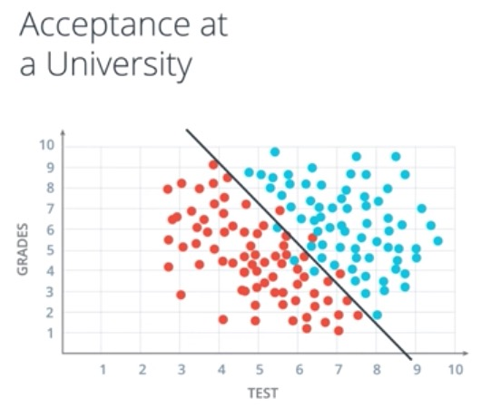

**Figure 1:** 2D Graph shows whether students are accepted into university based on Test and Grades

**2 Dimensions**

The boundary line separating the blue points from red points has an equation:

Specific Boundary:

A Line Equation: 

~~~python
2x_1 + x_2 - 18 = 0
~~~

The equation above is the method for rejecting or accepting students to make it easier to see, we substitute score, Test and Grades into the equation:

~~~python
Score = 2*Test + Grades - 18
~~~

Prediction:

When a student comes in, we check their score, if it is a positive number, then student accepted, else student is rejected, also known as a prediction.

~~~python
Score >= 0: Accepted
Score < 0: Reject
~~~

The linear equation is our model.

General Boundary:

In the more general case,

A Line Equation:

~~~python
w_1*x_1 + w_2*x_2 + b = 0
~~~

The equation will be abbreviated in vector notation as:

~~~python
W*x + b = 0
~~~

where W is the vector:

~~~python
W = (w_1, w_2)
~~~

where x is the vector:

~~~python
x = (x_1, x_2)
~~~

Thus, we take the product of the two vectors in the equation with vector notation. x will be inputs, W weights and b bias.

For student coordinates, x1 and x2 will denote the label as y. The label is what we are trying to predict. So, if the student gets accepted, mainly the point is blue, then the label is y = 1. If the student gets rejected, the point is red and the label is y = 0.

~~~python
y = label: 0 or 1
~~~

Thus, each point is in the form x1,x2 and y where y is 1 for the blue points and 0 for the red points.

Prediction:

Our prediction is y_hat and it is what the algorithm predicts the label will be. In this case, y_hat is 1 if the algorithm predicts the student gets accepted, which means the point lies over the line. y_hat is 0 if the algorithm predicts the student gets rejected, which means the point is under the line.

~~~python
      = 1 if Wx + b >= 0
y_hat
      = 0 if Wx + b < 0
~~~

**Quiz Question:**

Now that you know the equation for the line (2x1 + x2 - 18=0), and similarly the “score” (2x1 + x2 - 18), what is the score of the student who got 7 in the test and 6 for grades?

Answer: 2

### Higher Dimensions

**3 Dimensions**

What happens when we have more than 2 columns of data? What do we do if we have 3 columns of data?

Grades, Test and Class Rank?

We will be working in 3 dimensions instead of 2. So now we have 3 axis, x1 for test, x2 for grades and x3 for class ranking. Our data will look like a bunch of points flying in 3D. 

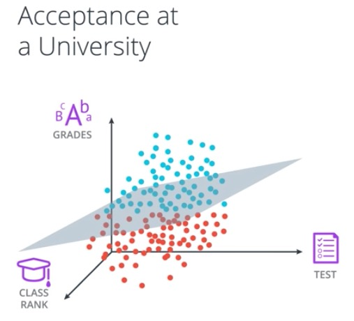

**Figure 2:** 3D Graph shows if students are accepted into university based on Test, Grades, Class Rank

Our equation won't be a line in 2 dimensions, but a plane in 3 dimensions.

Boundary:

A Plane Equation:

~~~python
w_1*x_1 + w_2*x_2 + w_3*x_3 + b = 0
~~~

This equation can still be abbreviated by:

~~~python
W*x + b = 0
~~~

The difference is that our vectors will have 3 entries instead of 2.

W = (w_1, w_2, w_3)

x = (x_1, x_2, x_3)

Prediction:

Our prediction will still be:

~~~python
      = 1 if Wx + b >= 0
y_hat
      = 0 if Wx + b < 0
~~~

**n Dimensions**

n-dimensional space with x1,x2,...,xn inputs. 

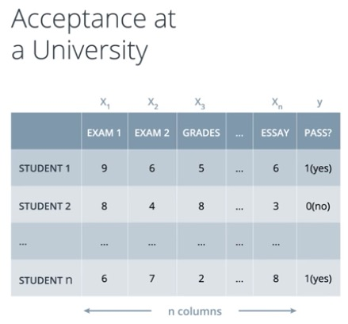

**Figure 3:** n-D table shows if students are accepted into university based on n-inputs

Boundary:

n-1 dimensional hyperplane, which is the high dimensional equivalent of a line in 2D or a plane in 3D.

n-1 Dimensional Hyperlane Equation:

~~~python
w_1*x_1 + w_2*x_2 + w_n*x_n + b = 0
~~~

We can still abbreviate to:

~~~python
W*x + b = 0
~~~

Our vectors now have n entries of 3.

W = (w_1, w_2, w_n)

x = (x_1, x_2, x_n)

Prediction:

Our prediction is still the same as before:

~~~python
      = 1 if Wx + b >= 0
y_hat
      = 0 if Wx + b < 0
~~~

**Quiz Question:**

Given the table in the video above, what would the dimensions be for input features (x), the weights (W), and the bias (b) to satisfy (Wx + b)?

- W: (nx1), x: (1xn), b: (1x1)
- W: (1xn), x: (1xn), b: (nx1)
- W: (1xn), x: (nx1), b: (1x1)
- W: (1xn), x: (nx1), b: (1xn)

Answer = W: (1xn), x: (nx1), b: (1x1)

### Perceptrons

A perceptron is the building block of neural networks. It is the encoding of our equation into a small graph.

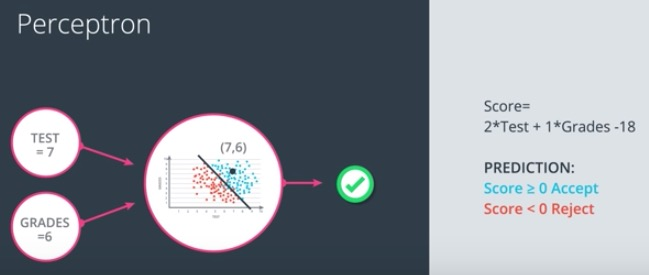

**Figure 4:** perceptron encodes our equation into small graph, takes input, predicts output

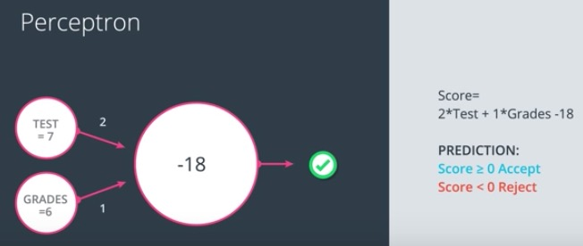

**Figure 5:** notation 1 of perceptron takes input, weights label the edges, bias label the node

One way to build a perceptron is the following:

- we have the input data and boundary line
- we fit our equation and graph inside a node
- we add some nodes for the input (ex: Test, Grades)
- perceptron plots a point based on input data and checks if it is in the positive or negative area.
- if the point is in the positive area, the perceptron returns a yes
- if the point is in the negative area, the perceptron returns a no
- lets consider our linear equation, Score = 2*Test + 1*Grades - 18,
- 2, 1, and -18 define the linear equation, so they'll be used as labels in the graph
- 2 and 1 will label the edges coming from x1 and x2 respectively
- The bias unit -18 will label the node
- Thus, when we see these labels, we can think of the equation they generate

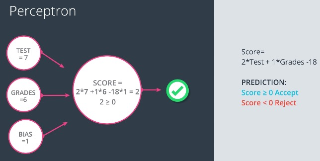

**Figure 6:** notation 2 of perceptron takes input, weights label the edges, bias label an edge

Second way to build a perceptron is the following:

- consider the bias a part of the input
- `w1 * Test`, `w2 * Grades`, so it is natural to think `bias * 1`
- so we have b labeling the edge coming from a 1
- so what the node does is that it multiplies the values coming from the incoming nodes by the values on the corresponding edges, then it adds them and finally checks if the result is >= 0, if it is, then the node returns yes or value of 1, else the node returns a  no or value of 0

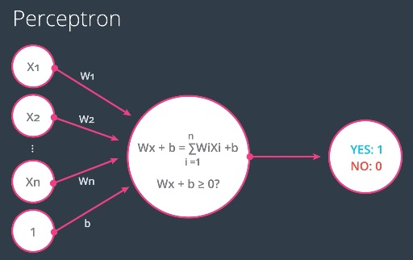

**Figure 7:** generation notation of perceptron takes n inputs & weights, a bias, then predicts output

In the general case, the nodes (perceptrons) will look as follows:

we have our node with n inputs coming in with values x1 up to xn and 1 along with edges w1 up to wn and b corresponding to the bias unit. Then the node calculates the linear equation `Wx + b`,which is the summation from i=1 to n of `Wi*Xi + b`. The node then checks if the value is 0 or bigger and if it is then the node returns a value of 1 for yes, else it returns a value of 0 for no.

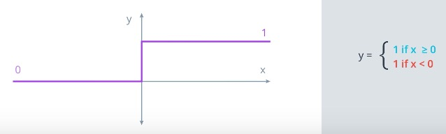

**Figure 8:** step function returns 1 if input is positive or 0 if input is negative

**Figure 9:** perceptron with combination of nodes

In **Figure 9**, the first node calculates the linear equation on the inputs on the weights and the second node applies the step function to the result

**Figure 9** can be graphed more generally as follows:

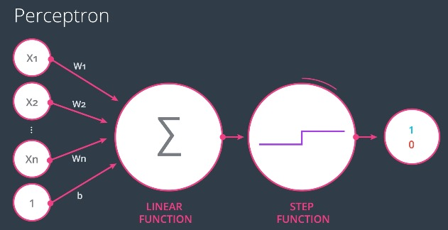

**Figure 10:** percepton with linear function and step function node

**Figure 10** can be graphed as follows:

The summation graph represents the linear function in the first node and the drawing represents the step function in the second node. In the future, different step functions may be used. Thus, it is important to specify it in the node.

As a review, we have seen two ways to represent the perceptron:

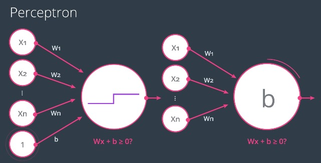

**Figure 11:** Two Notations of the Perceptron

The perceptron on the left has a bias node coming from an input node with a value of 1 and the one on the right has the bias inside the node.

**Quiz Question:**

Given Score = 2*Test + 1*Grade - 18, suppose w1 was 1.5 instead of 2. Would the student who got 7 on the test and 6 on the grades be accepted or rejected?

- Accepted
- Rejected

Answer = Rejected

### Why "Neural Networks"?

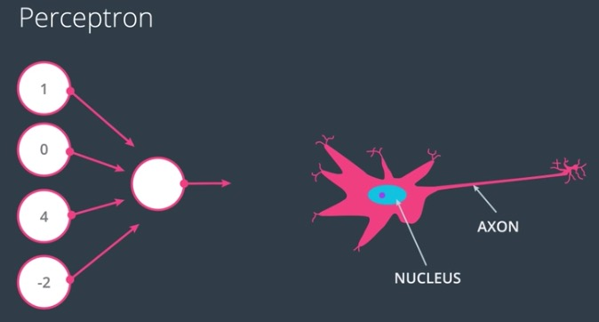

**Figure 12:** Perceptrons (Artificial Neurons) resemble neurons

Why are these objects called neural networks?

The reason they are called neural networks is because perceptrons look like neurons in the brain.

On the left, we have a perceptron with 4 inputs that calculates some equations on the input and decides to return a output signal as 1 or 0. Similarly, neurons in the brain take inputs coming from the dendrites. 

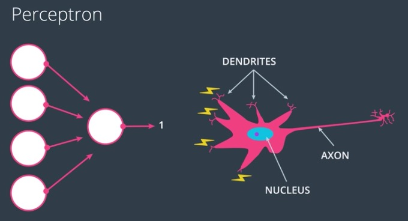

**Figure 13:** Neuron's inputs are nervous impulses

These inputs are nervous impulses. So what the neuron does is something with the nervous impulses and then it decides if it outputs a nervous impulse or not through the axon.

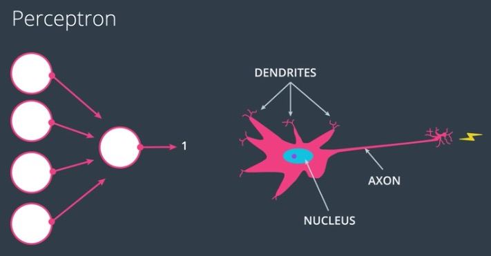

**Figure 14:** Neuron decision to output a nervous impulse or not

The way we'll be creating neural networks is by concatenating these perceptrons, so we'll be mimicing the way the brain connects neurons by taking the output from one perceptron and turning it into the input to another perceptron.

### Perceptrons as Logical Operators

Perceptrons make for many great applications, logical operators. In the lesson, I learned to create perceptrons for logical operators: AND, OR, NOT and XOR.

### AND Perceptron

**Figure 15:** Leftside is AND Perceptron and Rightside is AND Truth Table

#### What are the weights and bias for the AND perceptron?

I wrote code to set the weights (`weight1`, `weight2`) and the bias (`bias`) to values that'll correctly determine the AND operation shown above.

More than one set of values work, so the code could be updated.

~~~python
import pandas as pd

# TODO: Set weight1, weight2, and bias
weight1 = 1.0
weight2 = 1.0
bias = -2.0

# DON'T CHANGE ANYTHING BELOW
# Inputs and outputs
test_inputs = [(0, 0), (0, 1), (1, 0), (1, 1)]
correct_outputs = [False, False, False, True]
outputs = []

# Generate and check output
for test_input, correct_output in zip(test_inputs, correct_outputs):
    linear_combination = weight1 * test_input[0] + weight2 * test_input[1] + bias
    output = int(linear_combination >= 0)
    is_correct_string = 'Yes' if output == correct_output else 'No'
    outputs.append([test_input[0], test_input[1], linear_combination, output, is_correct_string])

# Print output
num_wrong = len([output[4] for output in outputs if output[4] == 'No'])
output_frame = pd.DataFrame(outputs, columns=['Input 1', '  Input 2', '  Linear Combination', '  Activation Output', '  Is Correct'])
if not num_wrong:
    print('Nice!  You got it all correct.\n')
else:
    print('You got {} wrong.  Keep trying!\n'.format(num_wrong))
print(output_frame.to_string(index=False))
~~~

### OR Perceptron

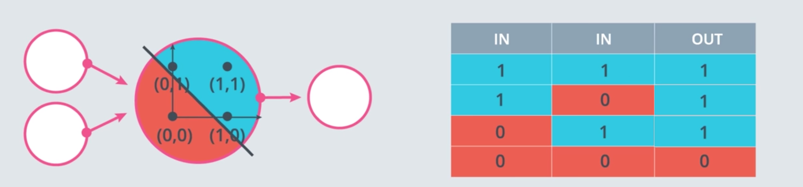

**Figure 16:** Leftside is OR Perceptron and Rightside is OR Truth Table

The OR perceptron is similar to AND, except the line is shifted down.

**Figure 17:** Convert AND to OR Perceptron

What can be done to the weights and bias to achieve this?

**Quiz Question:**

What are two ways to go from an AND perceptron to an OR perceptron?

- Increase the weights
- Decrease the weights
- Increase a single weight
- Decrease a single weight
- Increase the magnitude of the bias
- Decrease the magnitude of the bias

Answer = 

- Increase the weights
- Decrease the magnitude of the bias

### NOT Perceptron

NOT operation only cares about one input. So, NOT operation returns a `0` if input is `1` and `1` if input is `0`.

I wrote code to set the weights (`weight1`, `weight2`) and bias (`bias`) to values that'll correctly determine the NOT operation on the second input and ignores the first input and bias:

~~~python
import pandas as pd

# TODO: Set weight1, weight2, and bias
weight1 = 0.0
weight2 = -1.0
bias = 0.0

# DON'T CHANGE ANYTHING BELOW
# Inputs and outputs
test_inputs = [(0, 0), (0, 1), (1, 0), (1, 1)]
correct_outputs = [True, False, True, False]
outputs = []

# Generate and check output
for test_input, correct_output in zip(test_inputs, correct_outputs):
    linear_combination = weight1 * test_input[0] + weight2 * test_input[1] + bias
    output = int(linear_combination >= 0)
    is_correct_string = 'Yes' if output == correct_output else 'No'
    outputs.append([test_input[0], test_input[1], linear_combination, output, is_correct_string])

# Print output
num_wrong = len([output[4] for output in outputs if output[4] == 'No'])
output_frame = pd.DataFrame(outputs, columns=['Input 1', '  Input 2', '  Linear Combination', 
                                              '  Activation Output', '  Is Correct'])
if not num_wrong:
    print('Nice!  You got it all correct.\n')
else:
    print('You got {} wrong.  Keep trying!\n'.format(num_wrong))
print(output_frame.to_string(index=False))
~~~

### XOR Perceptron

**Figure 18:** Leftside is XOR Perceptron and Rightside is XOR Truth Table

**Quiz: Build an XOR Multi-Layer Perceptron**

We'll build a multi-layer perceptron from AND, NOT and OR perceptrons to create XOR logic.

The neural network below contains 3 perceptrons, A, B, C and the last one (AND) is given. The input is from the first node and the output comes out of the last node.

**Figure 19:** XOR Multi-layer Graph with 3 perceptrons missing

The multi-layer perceptron above calculates XOR. Each perceptron is a logic operation AND, OR and NOT. 

**Quiz Question:**

Set the correct operations for the perceptrons A, B, C to calculate XOR.

Answer:

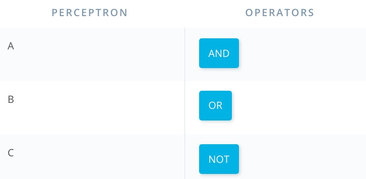

**Figure 20:** XOR Multi-layer Graph with 3 perceptrons identified

### Perceptron Trick

In real life, we can't be building these perceptrons, such as common logical operators, ourselves. The idea is we give them the result and they build themselves. So, we have a perceptron trick to help us.

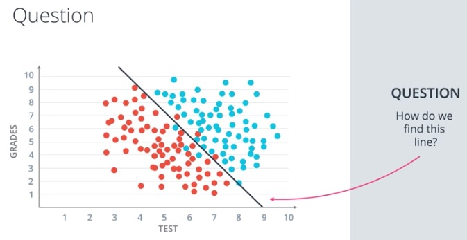

**Figure 20:** how do we find this line that separates blue from red points?

Let's look at simple example with data given 3 blue points and 3 red points. We are going to find an algorithm that splits these points properly. 

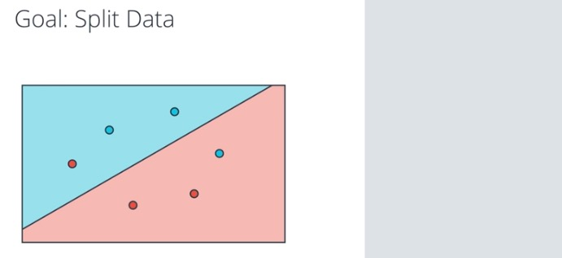

**Figure 21:** Computer picks random linear equation splitting the data

So, the computer doesn't know where to start, it might as well start at a random place by picking a random linear equation. This equation will define a line and a postive and negative area given in blue and red respectively. What we are going to do is look at how badly this line is doing and then move it around to try and get better and better. What we want to know, How do find out how badly this line is doing?

So, we ask all the points. We have four points correctly classified. They are the two blue points in the blue area and the two red points in the red area. These points are correctly classified, so they say "I am good."

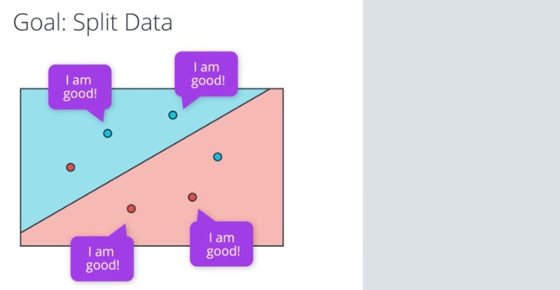

**Figure 22:** Four Points Correctly Classified. Two Points Misclassified.

Then we have these two points that are misclassified. The red point in the blue area and the blue point in the red area. We want to get as much info from them. So, we want them to tell us something so that we can improve this line. So what is it the misclassified points can tell us?

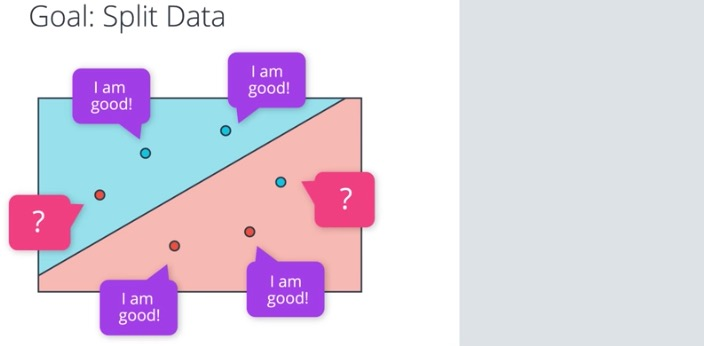

**Figure 23:** What do the misclassified points tell us?

Let's focus on the red point, if you were this point, what would you tell the line to do?

**Figure 24:** Red Misclassified Point

**Quiz Question:**

Does the misclassified point want the line to be closer or farther?

- Closer
- Farther

Answer: `Closer`

In order for the red point to be correctly classified, the line should move closer to it.

#### Time for some math

We can apply a mathematical trick to modify the equation of the line, so that it comes closer to a particular point. Say we have equation:

~~~
Line Equation: 3x1 + 4x2 - 10 = 0
~~~

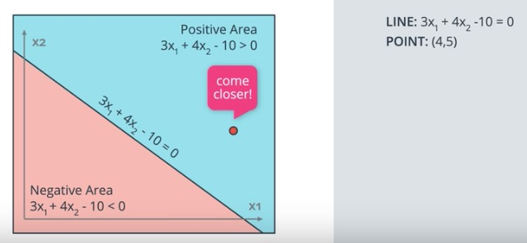

**Figure 25:** Line with postive and negative area

This linear equation gives us a line, which is the points (x1,x2) where the equation is 0 and two regions. The positive region drawn in blue where the equation is positive and the negative region drawn in red where the equation is negative. We have our lonely misclassified point: (4,5), which is a red point in the blue area, so the point says come closer. How do we get the line to come closer?

The idea is that we'll use the point (4,5) to modify the equation to get the line to move closer to the misclassified point. The parameters of the line are `3, 4, -10`. The coordinates for the point are (4,5) and 1 for bias unit. So, what we can do is subtract these numbers`4, 5, 1` from the parameters of the line. So, the new line will have parameters `-1, -1, -11`. Thus, the line will move drastically toward the misclassified point maybe even classifying it correctly. However, since we have alot of other points, we don't want to make drastic moves since we may accidently end up misclassifying our already correctly classified points. 

**Figure 26:** Modify Equation to move drastically toward misclassified red point

We want the line to make small movements (or steps) toward the point, so we use learning rate. The learning rate is a small number, such as `0.1`. So, what we do is multiply the `4, 5, 1` by the learning rate. Thus, we subtract smaller numbers from the equation of the line and obtain a new equation. The line moves closer up to the misclassified red point in the blue area.

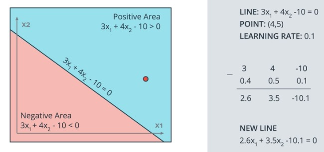

**Figure 27:** Modify Equation to move cautiously toward misclassified red point

Similar, if we have a blue point (1,1) in the red area, which is a positively labeled point in the negative area, this point is also misclassified and it says to the line to come closer. How we do this is by adding the coordinates to the parameters of the line. Again, we multiply the coordinates by the learning rate to make small steps.

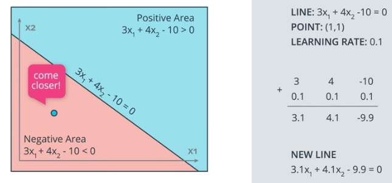

**Quiz Question:**

For the second example, where the line is described by 3x1+ 4x2 - 10 = 0, if the learning rate was set to 0.1, how many times would you have to apply the perceptron trick to move the line to a position where the blue point, at (1, 1), is correctly classified?

Answer = `10`

We have to apply the perceptron trick 10 times to move the line to a position where the blue point is correctly classified.

> Note: feel free to write out the line equation on some scratch paper and test the perceptron trick.

### Perceptron Algorithm

Learn how to develop the percepton algorithm and code it in Python.

### Coding the Perceptron Algorithm

Implement the perceptron algorithm to separate the following data:

