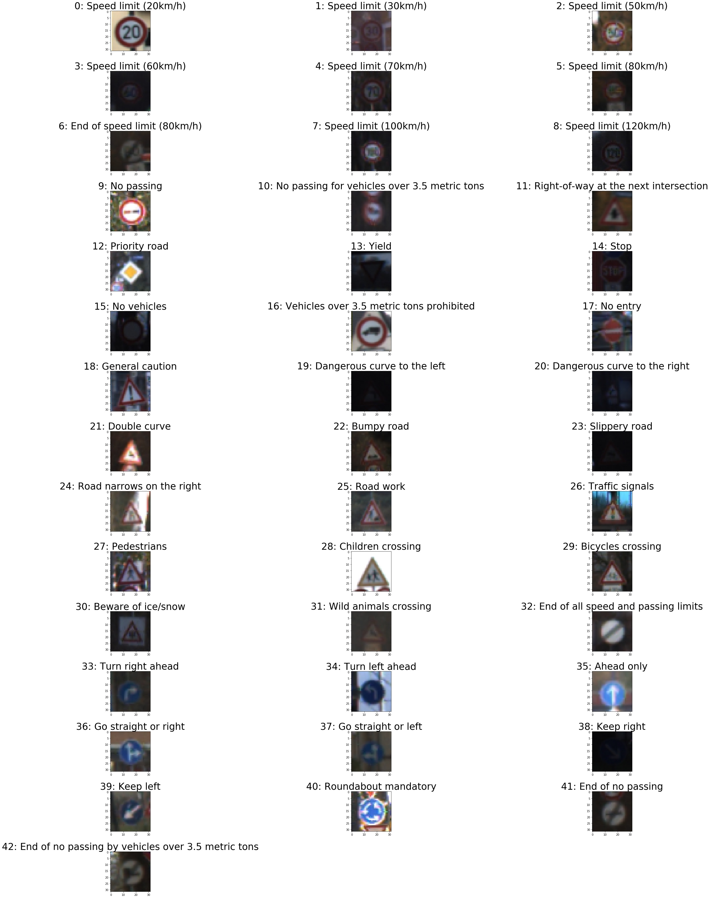
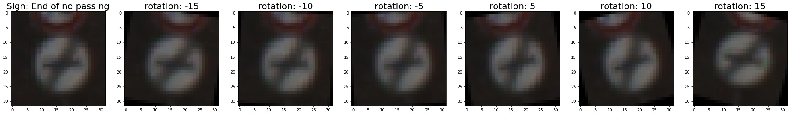

# Traffic Sign Classification with LeNet

by James Medel, November 6, 2019

## Introduction

One of the first lessons human drivers learn before driving cars on the street is recognizing the traffic signs. Artificial intelligent drivers (self-driving cars) must also learn to classify these traffic signs before driving on the street. Traffic signs display valuable information to drivers that direct, inform and control their behavior in effort to make the roads more safe. 

This project involved working on a self-driving car perception problem known as traffic signalization detection. Specifically, I focused on traffic sign recognition and developed a deep learning application to classify different german traffic signs. The highlights of this solution include exploratory data analysis (EDA), data preprocessing, data augmentation, convolutional neural network (CNN) architecture interpretation from a research paper, LeNet architecture implementation using TensorFlow 1.4, building the training pipeline to train the LeNet model, developing the evaluation pipeline to evaluate the model's prediction accuracy, visualizing the model's top 5 softmax probabilities to show the certainty of the model's predictions and visualizing the inner layers of the model's network to understand what features the model focuses on. 

- Jupyter Notebook is available at the Github link: [Traffic_Sign_Classifier_with_LeNet.ipynb](https://github.com/james94/P3-Traffic-Sign-Classifier-CarND/blob/master/Traffic_Sign_Classifier_with_LeNet.ipynb)

- HTML version is available: [Traffic_Sign_Classifier_with_LeNet.ipynb](https://github.com/james94/P3-Traffic-Sign-Classifier-CarND/blob/master/Traffic_Sign_Classifier_with_LeNet.html)

## Dataset Summary & Exploration

During the dataset exploration task, I used exploratory data analysis (EDA) to analyze, summarize and visualize the contents of the dataset. Exploring the data before doing anything with it is important because if you run into a problem, you will have an idea where to look for potential sources of error.

### Dataset Summary

`Submission includes basic summary of the data set`

The lifelike traffic sign database we were required to use for the deep learning application was the [German Traffic Sign Recognition Benchmarks (GTSRB)](http://benchmark.ini.rub.de/?section=gtsrb&subsection=dataset) dataset. GTSRB has the following properties: more than 40 classes, more than 50,000 images in total and lifelike database. The dataset was provided as pickle files for the training, validation and testing set. The pickled data has 4 key/value pairs and the keys are 'features', 'labels', 'sizes' and 'coords'. The 'features' key value is a 4D array containing raw pixel data of the traffic sign names (num of examples, width, height, channel). The 'labels' key value is a 1D array containing the class id of the traffic sign. Later this class id is used in the [signnames.csv]() to look up the traffic sign text names for exploratory visualization. The 'sizes' key value is a list containing tuples (width, height) representing the original width and height of the image. The 'coords' key value is a list containing tuples (x1, y1, x2, y2) representing coordinates of a bounding box around the sign in the image. 

For the project, I loaded the 'features' and 'labels' pickled data for the training, validation and testing set. I calculated the summary of the data set using numpy. I created a pandas dataframe out of the data summary and then visualized the dataframe in a matplotlib table:

**Table 1: GTSRB Dataset Summary**

### Exploratory Visualization

`Submission includes an exploratory visualization on the dataset`

I performed multiple exploratory visualizations on the German Traffic Sign Dataset using Matplotlib. First, I displayed the 43 german traffic signs by image and traffic sign type in subplots as a gallery:

**Figure 1: Gallery of Traffic Sign Types**

I displayed the count of occurrences for each unique traffic sign in a table for the training set, validation set and testing set:

**Tabe 2: Count of Traffic Sign Type Occurrences**

Similary, I visualized the distribution of traffic sign types in the training, validation and testing set as individual bar graphs:

**Figure 2: Distribution of Traffic Sign Types in Training Set** 

**Figure 3: Distribution of Traffic Sign Types in Validation Set** 

**Figure 4: Distribution of Traffic Sign Types in Testing Set** 

From looking at **Figure 2** the distribution graph for traffic sign types in the training set, **keep right**, **yield**, **priority road**, **speed limit (50km/h)** and **speed limit (30km/h)** have highest occurrences. Therefore, when the CNN model is trained, it probably will do well in classifying those particular traffic sign types. Since the validation set has a similar distribution for traffic sign types as the training set, the CNN model will most likely achieve a high validation accuracy. Likewise, the testing set also has this similar distribution for traffic sign types as the training set, so the CNN model's predictions will probably be high testing accuracy too. However, if I later download german traffic signs from the internet that the CNN model did not learn well and have the model classify them, the mode's predictions for these new web images will most likely be low accuracy.

## Design and Test a Model Architecture

### Preprocessing

`Submission describes the preprocessing techniques used and why these techniques were chosen`

Data preprocessing techniques of data augmentation, image normalization, data shuffling and one-hot encoding were performed to improve the deep learning classification model's ability to learn to classify traffic signs, resulting in higher prediction accuracy.

### Data Augmentation

Data augmentation was applied to the training set using OpenCV since there was not a sufficient amount of data for the model to generalize well. From looking at the bar graph distribution of traffic sign types for training set in **Figure 2**, we could see the data is unbalanced and some traffic sign types are represented to a higher extent than other types. We will apply rotation operations to augment the data and work on balancing the training set.

After experimenting with adding scaling, translation, rotation, flipping, salt and pepper noise and lighting conditions augmentation techniques, I used **rotation transformations** in the Python pipeline. I applied 6 rotation operations from -15 to +15 degrees to augment the training set, so the deep learning model can recognize the traffic signs in multiple orientations. There was not a need to rotate images past plus or minus 15 degrees because traffic signs are typically perpendicular to the ground and sometimes we may find them slightly tilted.

**Figure 5: Augment Image with 6 rotations** 

After rotation augmentation was applied to the training set, it increased from 34,799 to 208,794 images.

### Image Normalization

[Minx-Max scaling](https://sebastianraschka.com/Articles/2014_about_feature_scaling.html#about-min-max-scaling) normalization was applied to training, validation and testing data to change the range of pixel intensity, so all images can have a consistent range for pixel values. 

Image normalization was chosen as a preprocessing technique to deal with contrast stretching, stabilize the model and improve gradient calculation.

Equation:

### Data Shuffling

Data shuffling was performed on the entire training set, so the training images in each batch can better represent the entire training set.

### Model Architecture

I implemented a 5 layer CNN model based on [Yann LeCun's 1998 journal article LeNet architecture](http://yann.lecun.com/exdb/publis/pdf/sermanet-ijcnn-11.pdf) using Tensorflow. The architecture consists of 2 convolution layers followed 3 fully connected layers. The convolution layers handle extracting features from the traffic sign images that are useful for learning how to recognize them. Each convolution layer is followed by relu activation and max pooling for filtering images to the pixels that matter. After the last convolution layer, flatten operation is applied to transform the output shape into a vector. The first two fully connected layers are followed by relu activation and dropout for preventing the model from overfitting the data. The fully connected layers shrink the output vector to 43 different classes, so the model can predict the traffic sign type in the image.

![cnn-architecture]

The breakdown of the 5 layer CNN model:

**Formula for Convolutions**:

![Out_{h} = (in_{h} - filter_{h} + 1)/strides[1]](https://latex.codecogs.com/svg.latex?Out_%7Bh%7D%20%3D%20%28in_%7Bh%7D%20-%20filter_%7Bh%7D%20&plus;%201%29/strides%5B1%5D)

![Out_{w} = (in_{w} - filter_{w} + 1)/strides[2]](https://latex.codecogs.com/svg.latex?Out_%7Bw%7D%20%3D%20%28in_%7Bw%7D%20-%20filter_%7Bw%7D%20&plus;%201%29/strides%5B2%5D)

**Formula for Max Pooling**:

The network takes a 32 by 32 image as input, then that image goes through convolutional layer 1.

Convolutional layer 1 has a 5x5 filter with an input depth of 3 and an output depth of 64 and initilizes the bias. Then this layer convolves the filter over the images and adds the bias at the end giving us an output of 28 by 28 by 64. The **formula for convolutions** tell us how to calculate the output height and width for convolutional layer. Next the output of this layer is activated with a relu activation function. Then the output is pooled with a 2 by 2 kernel with a 2 by 2 stride giving us a pooling output of 14 by 14 by 64. The **formula for pooling** tells us how to calculate the output height and width for max pooling.

The network then runs through convolutional layer 2, which is a set of convolutional, relu activation and pooling layers giving an output of 5 by 5 by 32.

Then this output is flattened to a vector with length 5x5x32 equalling 800. 

This vector is passed to fully connected layer 3 with a width of 120. Then a relu activation is applied the output of this fully connected layer. Finally, the dropout regularization technique is performed on the output dropping 50% of the neurons. Dropout is used to minimize overfitting to the training data and improve generalization of the model.

The network then runs through fully connected layer 4, which is a set of fully connected, relu activation and dropout layers giving an output width of 84.

Finally, fully connected layer 5 is connected to the end of the network to output a width equal to the number of traffic sign types in our label set, 43 classes.

### Model Training

`Submission describes how the model was trained`

First I setup Tensorflow hyperparameters and variables used for training the model:

The **learning rate equals 0.001** since it is a good default value. The learning rate tells Tensorflow how quickly to update the weights. The **epochs equals 10** to tell Tensorflow to run the training data through the network 10 times. The epochs was set to 10, so training would not take too long and because the model's validation accuracy was near 100%. The **batch size equals 64** to tell Tensorflow to run 64 training images at a time. I decided to go with a smaller batch size to consider processors with memory limitations. The downside of using 64 batches is that the model training will take longer, but that should not be a problem since the epochs equals 10.

The Tensorflow variables are set up. **x** is a placeholder that stores the input batches. The batch size for x is initialized to None to allow the placeholder to later accept a batch of any size. The image dimensions for x were set to 32 by 32 by 3. **y** is a placeholder that stores the labels as integers, meaning they are not one hot encoded. The tf.one_hot(y, 43) function is used to one hot encode the labels and that result is stored into **one_hot_y**.

Now with the Tensorflow hyperparameters and variables setup, I can activate the training pipeline by passing training images to it. The pipeline then trains the model. Let's dive into the pipeline to see how it trains the model. As data is pushed into the pipeline, that data is loaded into the **LeNet()** function to calculate the logits. Those logits are then compared with the ground truth labels and the cross entropy is calculated using the **tf.nn.softmax_cross_entropy_with_logits()** function. The average cross entropy from all the training images is computed using the **tf.reduce_mean()** function. Next the Adam optimizer with the learning rate minimizes the loss function using the **tf.train.AdamOptimizer()** function. Stochastic gradient descent is similar to the Adam optimizer, but we used Adam because it is more sophisticated. Finally the pipeline runs the minimize() function on the optimizer, which uses backpropagation to update the network and minimize the model's training loss.

With the training pipeline implemented, let's explore how the 64 batches of training data was being passed to the pipeline to train the model. A Tensorflow session was created to initialize the Tensorflow variables and train the model over 10 epochs. At the start of each epoch, the training data was shuffled to ensure that the training data is not bias by the order of the images. Next the training data was split into batches, the batch data was passed to the training pipeline and the model was trained on each batch. 

How do we know if our trained model has high prediction accuracy and is worth saving? We need to evaluate the model while it is being trained.

### Model Evaluation

Now that the model is trained, an evaluation pipeline was used to evaluate the model's performance. Let's dive into the pipeline to see how it evaluates the model. The first step in this pipeline was to compare the logit prediction to the one hot encoded ground truth label using **tf.equal(tf.argmax(logits,1), (tf.argmax(one_hot_y,1))**. The last step in this pipeline was to calculate the model's overall accuracy by averaging the individual prediction accuracies using **tf.reduce_mean(tf.cast(correct_prediction, tf.float32)**.

With the evaluation pipeline implemented, an **evaluate()** function was used to actually run the evaluation pipeline. This function takes a dataset as input, batches the dataset, then runs it through the evaluation pipeline and averages the accuracy of each batch to calculate the total accuracy of the model.

With the **evaluate()** function implemented to run the evaluation pipeline, let's return to the stage of training our model, at the end of each epoch, we can also evaluate the model's prediction accuracy on the validation data. Once we have completely trained the model and it achieves high prediction accuracy at least 93% on the validation data, we can save the model and later test it on the testing data.

### Solution Approach

`Submission describes the approach to finding a solution`

My final model results for traffic sign recognition were **Validation Accuracy = 97.3%** and **Test Accuracy = 96.4%**. When starting the project, I chose the LeNet architecture developed by Yan Lecun in 1998. This network architecture was already well known for it's great performance on image recognition, specifically on classifying hand written numbers from the MNIST dataset. Since hand written digit recognition and traffic sign recognition are similar, both use cases detect patterns in images and match them with labeled training data, this model with some modifications would work well for my project.

When I trained and evaluated the model for the first time, the result was 89.5% validation accuracy. To meet the requirements for the project, the validation accuracy needed to be 93% or higher. I tried tuning the hyperparameters for the model and found changing the batch size to 64 increased validation accuracy. I also found that adding the dropout regularization layers at the end of the first two fully connected layers increased the validation accuracy to 95.1%. Once I started augmenting the training data with 6 rotations from -15 to +15 degrees followed by normalizing the data, then I noticed the validation accuracy increase to 97.3%.

## Test a Model on New Images

### Acquiring New Images

`Submission includes five new German Traffic signs found on the web and visualized`

I downloaded 5 German traffic signs of varying sizes from the internet. I did not consider whether the image size was the same size I used to train the model. I also chose some images where the traffic signs were not at the center of the image like images used in the training, validation and testing set. Some of the images have cars, buildings and trees in the background. I was curious to see how accurate the trained model would be at classifying traffic signs with more noise than usual.

I preprocessed the images by resizing them to 32 by 32, so they would be the dimensions the model expects. Then I normalized the new data before passing it to the model to be predicted.

### Performance on New Images

`Submission documents the performance of the model when tested on captured images`

The performance on the new images is compared to the accuracy results of the test set

The model classified 3 out of 5 traffic signs correctly in the new images from the internet. Thus, the model's test accuracy was 60%. When comparing the model's prediction accuracy on the new images to the accuracy results on the testing set, the model performed 36% worse. This performance accuracy makes sense since these 5 new images had different sizes, rotations, noise and lighting conditions than the test images compared to the German traffic sign dataset.

I used **tf.argmax()** function and passed logits to it to retrieve the predicted traffic sign type numbers. Earlier we mentioned, these traffic sign type numbers can be used in the **signnames.csv** file to look up the traffic sign names.

### Model Certainty - Softmax Probabilities

`Submission discusses how certain or uncertain the model is of its predictions`

Top five softmax probabilities of the predictions on captured images are outputted

For the first image, the model was 86.6% certain that the image was a traffic sign indicating "End of no passing by vehicles over 3.5 metric tons," but the traffic sign in the image was actually a "Speed limit (50km/h)." All the remaining softmax probabilities for this first image were not correct. For the second image, the model was 53.5% certain the image contained a traffic sign indicating "Priority road," but it was actually a "Children crossing" sign. For the third, fourth and fifth image, the model was 100% certain that the image was a "No entry," "Priority road" and "Road work" traffic sign. For the last 3 new images, the model was correct in it's prediction.

### Visualize Layers of the Neural Network

Deep neural networks are often referred to as a black box. We can understand what the weights of a network look like by plotting the network's feature maps. After the network was trained, I passed a test image and the name of a convolutional layer into an **outputFeatureMap()** function to visualize that layer's feature maps. The feature map shows the patterns that the network's layer is detecting. Here is an example of visualizing convolutional layer 2 pooling **conv2_pool**, notice there are 32 feature maps:

## Conclusion

This project focused on building traffic sign recognition application using exploratory data analysis, computer vision and deep learning. Some of the highlights from this project include learning to interpret a deep neural network architecture from a research paper and implementing it with Tensorflow, visualizing all sorts data to bring meaningful insight to users and increasing the deep learning model's prediction accuracy using data preprocessing techniques.

## References

[About Feature Scaling and Normalization - and the effect of standardization for machine learning algorithms](https://sebastianraschka.com/Articles/2014_about_feature_scaling.html#about-min-max-scaling)
